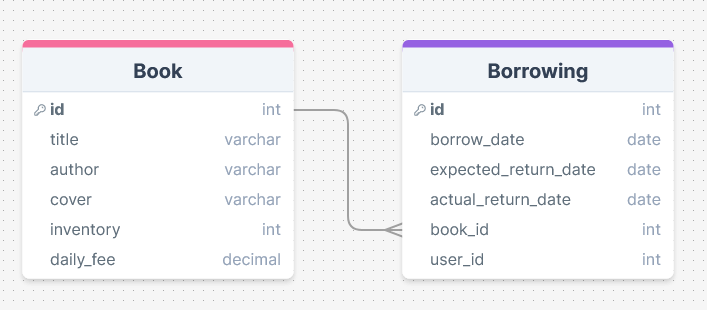

# Library Service API

API Service for borrowing management, written on DRF and deployed using Docker.

## Installing using GitHub
    
```bash
git clone https://github.com/RomanHlodann/library-service
cd py-library-api
python -m venv venv
On mac: source venv/bin/activate Windows: venv/Scripts/activate
pip install -r requirements.txt
set DB_HOST=<your db hostname>
set DB_NAME=<your db name>
set DB_USER=<your db user>
set PASSWORD=<your db user password>
set SECRET_KEY=<your secret key>
set CELERY_BROKER_URL=<your celery broker url>
set CELERY_RESULT_BACKEND=<your celery result backend>
set TELEGRAM_BOT_API=<your telegram bot api key>
set TELEGRAM_CHAT_ID=<your telegram chat id>
python manage.py migrate
docker run -d -p 6379:6379 redis
celery -A library worker -l info
python manage.py runserver
```

## Run with Docker
To run the project with Docker, follow these steps:

```bash
docker-compose up
```

## Features
* JWT authenticated
* Documentation is located at `/api/doc/swagger/`
* Docker
* Postgresql
* Celery
* Telegram API
* Filtering borrowings
* Email as a username

## DB Schema



## Access the API endpoints via 
`http://localhost:8000/`
* **Book** `api/library/books/`
* **Borrowing** `api/library/borrowings/`
* **Return borrowing** `api/library/borrowings/<int:id>/return/`

To operate with tokens:
* **Get tokens** `api/users/token/`
* **Refresh token** `api/users/token/refresh/`
* **Verify token** `api/users/token/verify/`
* **Register** `api/users/register/`
* **Get profile** `api/users/me/`